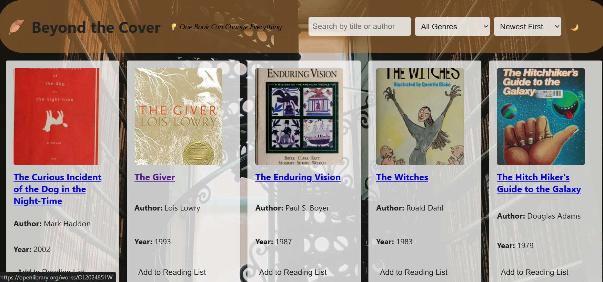

## 📚 Beyond the Cover

Welcome to **Beyond the Cover** — a book lover's dream I brought to life through a blend of code, creativity, and way too many cups of coffee ☕. This isn't just another search-and-browse app. It's where your personal reading journey begins — one book at a time.

---

## 🖼️ Preview

---
## 🌟 Why I Made This

I've always loved stories. But I also love *systems* — which is why I created **Beyond the Cover**.

The idea came from trying to organize my own chaotic reading habits: books I *want* to read, books I *should* be reading, and books I *pretend* I've already finished 😅. I wanted an app that’s not just useful, but beautiful and intuitive — something that brings joy while keeping my bookish life in check.

So I decided to build it myself.

---

## ✨ Features

### 🔍 Search & Filter
Search for books by title or author using real-time results powered by the OpenLibrary API. Narrow things down by genre or subject for a tailored discovery experience.

### 🔥 Trending Books
Get inspired by what's hot and popular — automatically pulled from OpenLibrary’s massive collection based on popular keywords.

### 📚 Reading List
Build your personal reading list and manage it with ease. Each book entry includes:
- Status updates (Want to Read, Reading, Finished)
- Personal notes
- Star ratings (0–5)

### 📝 User Authentication
Create an account or sign in to access your own private reading list. All reading progress and notes are stored per user.

### 🎨 Beautiful UI
- Custom light/dark theme toggle 
- Transparent, modern styling
- Background image gives a cozy, elegant vibe
- Responsive design for mobile and desktop users

---

## 💡 Technologies Used

| Tech             | Purpose                                  |
|------------------|------------------------------------------|
| HTML/CSS         | Structure and styling                    |
| JavaScript       | Dynamic UI, interactivity, logic         |
| JSON Server      | Mock backend with REST API               |
| OpenLibrary API  | Real-world book data and cover images    |

---

## 🚀 Getting Started

Here's how to get it running on your machine:

### 🔧 Requirements
- [Node.js](https://nodejs.org/)
- JSON Server (`npm install -g json-server`)

### 🛠️ Setup

``bash
# Clone the repo
git clone https://github.com/Mercy5-k/beyond-the-cover.git
cd beyond-the-cover

# Start the JSON server
json-server --watch db.json --port 3000

# Open index.html in your browser ``

## 🧠 What I Learned

This project taught me a ton, including:

- How to integrate a public API (OpenLibrary) with a local backend (JSON Server)

- Using async/await and handling asynchronous fetch calls

- Creating flexible, responsive layouts with modern CSS

- Building a functional user authentication system (mocked but real-world structured)

- Managing application state (logged-in user, filters, UI modes)

## 💬 Future Enhancements

- 🧠 Smarter recommendations based on user history

- 🔐 JWT authentication and persistent login

- 🗂 Pagination or infinite scroll for large search results

- 📱 PWA (Progressive Web App) support for offline reading list access

- 💾 Local storage fallback when backend is offline

- 🖼 Drag-and-drop functionality for reordering the reading list

## ✍️ Author
Hi! I'm the developer behind Beyond the Cover 👋
I'm passionate about turning ideas into experiences — especially when books and tech collide. Whether it’s fiction, nonfiction, or a well-documented API, I’m all about diving into stories that shape the way we see the world.
If you're a developer, reader, or both — feel free to connect. I'd love to chat, collaborate, or hear what you’re currently reading 📖

## 📫 Contact
GitHub: Mercy5-k

Email: kiqsmercy@gmail.com

## 📜 License
This project is open source under the MIT License. Feel free to fork, remix, and build on top of it!

“Reading is essential for those who seek to rise above the ordinary.” – Jim Rohn

Thanks for checking out Beyond the Cover. May your reading list be long, and your coffee cup full ☕📘
